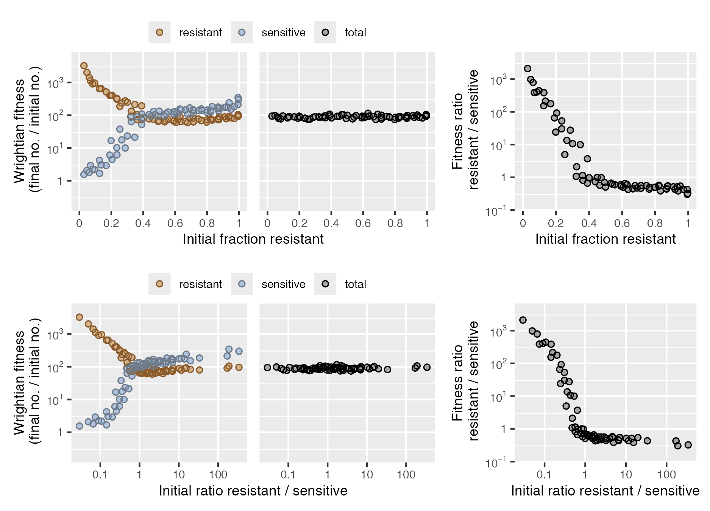

<!-- README.md is generated from README.Rmd. Please edit that file -->

```{r, include = FALSE}
knitr::opts_chunk$set(
  collapse = TRUE,
  comment = "#>",
  fig.path = "man/figures/README-",
  out.width = "100%"
)
```

<!-- badges: start -->
[](https://github.com/matryoshkev/microbimixr/actions/workflows/R-CMD-check.yaml)
<!-- badges: end -->

microbimixr is an R package for analyzing microbial interactions in mix experiments. A common experimental design is to mix together two microbes (different strains of bacteria, for example) then measure how their survival and reproduction depend on mix frequency. How do they act differently together than on their own? microbimixr helps researchers get the most out of the data from these experiments by providing tools to:

* Calculate best-practice fitness measures
* Identify which measures to use with a specific dataset
* Make publication-quality figures showing interaction effects


## Calculate fitness effects

There are many ways to quantify microbial survival and reproduction. microbimixr makes it easy to calculate fitness measures that are: 

* Robust and quantitatively comparable across different species and different types of interaction
* Useful for both individual and group-centered approaches to social behavior
* Well-suited to statistical analysis of effect sizes and confidence intervals
* Directly comparable to theoretical models of microbial evolution

Starting from a data frame with the initial and final abundance of each microbe, calculate fitness effects with `calculate_mix_fitness()`:

```{r eval = TRUE}
library("microbimixr")
fitness_myxo <- calculate_mix_fitness(
	data_smith_2010, 
	var_names = c(
		initial_number_A = "initial_cells_evolved",
		initial_number_B = "initial_cells_ancestral",
		final_number_A = "final_spores_evolved",
		final_number_B = "final_spores_ancestral", 
		name_A = "GVB206.3", 
		name_B = "GJV10"
	)
)
head(fitness_myxo)
```

<!-- `calculate_mix_fitness()` works with most types of microbial abundance data including strain density, total group density, and strain frequency.  -->

microbimixr works with most types of microbial abundance data including cell count, cell density, and strain frequency. 


## Compare fitness measures

To quickly see what fitness measures would be most useful for your data, use `plot_mix_fitness()`. It draws a combined figure with strain fitness, total group fitness, and relative within-group fitness plotted against two measures of mix frequency.
```{r eval = FALSE}
plot_mix_fitness(fitness_myxo)
```
<!-- ggsave("README-compare-measures.png", width = 6.25, height = 4.5) -->


This interaction between two genotypes of _Myxococcus_ bacteria would be easiest to interpret in terms of total-group fitness as a function of initial genotype frequency and the within-group fitness ratio as a function of initial genotype ratio. These fitness effects are nearly linear (on log scales) and would be easiest to fit statistical models to. 


## Visualize interaction effects

Make publication-quality figures easily with `plot_strain_fitness()`, `plot_total_group_fitness()`, and `plot_within_group_fitness()`: 

<!--
Once you know which fitness measures to focus on, you can use microbimixr to visualize them. The simplest way is to use its built-in plot functions. They make figures with default settings suited to fitness data and have some basic graphical options. 

microbimixr provides convenience functions to make publication-quality figures with default settings appropriate for fitness data.  

fig_total <- plot_total_group_fitness(fitness_myxo)
fig_within <- plot_within_group_fitness(
	fitness_myxo, mix_scale = "ratio", ylim = c(1e-3, 1e3)
)
fig_total + fig_within
-->

```{r eval = FALSE}
library("patchwork")
plot_total_group_fitness(fitness_myxo, ylim = c(1e-8, 1)) +
plot_within_group_fitness(fitness_myxo, mix_scale = "ratio", ylim = c(1e-4, 1e4)) +
plot_annotation(tag_levels = "A")
```
<!-- ggsave("README-plot-functions.png", width = 5, height = 2.25) -->


You can also use the individual axes and other components of microbimixr plots with ggplot2: 

```{r eval = FALSE}
library("ggplot2")
fitness_myxo |>
	ggplot(aes(x = initial_fraction_A, y = fitness_total)) +
	scale_x_initial_fraction(name = "Initial frequency of evolved strain") +
	scale_y_fitness_total(name = "Group sporulation success\n(spores/cell)") +
	geom_smooth(method = "lm", se = FALSE, formula = y ~ poly(x, 2)) +
	geom_point_overlap(fill = "lightblue", color = "darkblue", size = 2) +
	theme_bw()
```
<!-- ggsave("README-plot-elements.png", width = 3, height = 2.25) -->
{width=50%}


## Installation

```{r eval = FALSE}
# The development version from GitHub:
# install.packages("devtools")
devtools::install_github("matryoshkev/microbimixr")
```

## Further reading

* smith j and Inglis RF (2021) Evaluating kin and group selection as tools for quantitative analysis of microbial data. Proceedings B 288:20201657. [https://doi.org/10.1098/rspb.2020.1657](https://doi.org/10.1098/rspb.2020.1657)


<!--
## Example

This is a basic example which shows you how to solve a common problem:

```{r example}
# library(microbimixr)
## basic example code
```

What is special about using `README.Rmd` instead of just `README.md`? You can include R chunks like so:

You'll still need to render `README.Rmd` regularly, to keep `README.md` up-to-date. `devtools::build_readme()` is handy for this.

You can also embed plots, for example:

```{r pressure, echo = FALSE}
# plot(pressure)
```

In that case, don't forget to commit and push the resulting figure files, so they display on GitHub and CRAN.
-->
