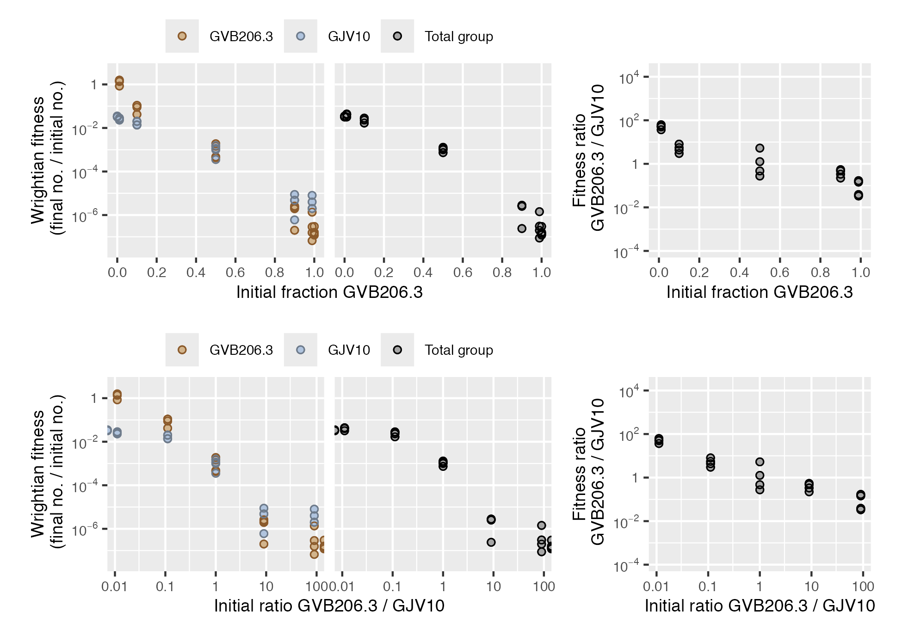
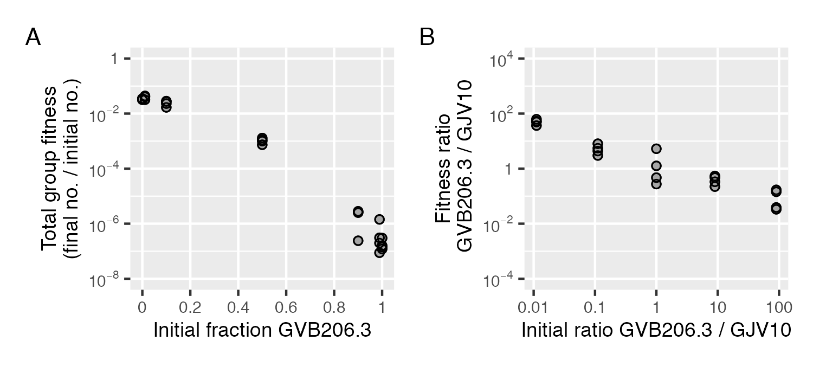
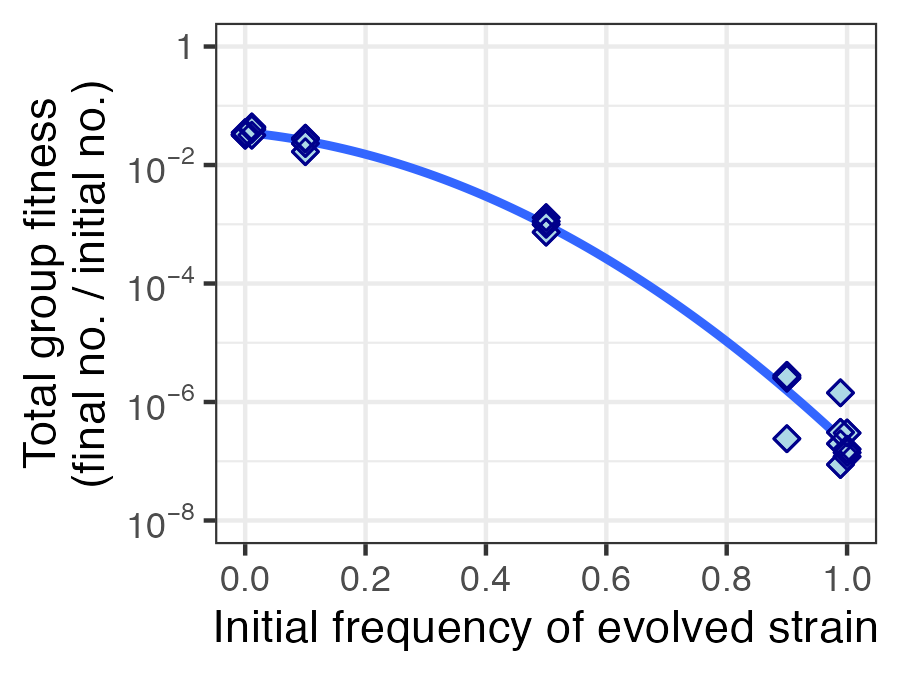

<!-- README.md is generated from README.Rmd. Please edit that file -->

```{r, include = FALSE}
knitr::opts_chunk$set(
  collapse = TRUE,
  comment = "#>",
  fig.path = "man/figures/README-",
  out.width = "100%"
)
library("ggplot2")
library("patchwork")
```

<!-- badges: start -->
[](https://github.com/matryoshkev/microbimixr/actions/workflows/R-CMD-check.yaml)
<!-- badges: end -->

## Overview

A common way to study microbial interactions is to mix together two different microbes (different bacteria strains, for example) then measure how their fitness depends on their frequency in the mix. How do they behave differently together compared to on their own? 

<!--
`microbimixr` is an R package that provides tools to **calculate and plot the fitness effects of microbial interactions**, helping researchers get the most out of their data. 
-->

microbimixr is an R package for analyzing microbial interactions in mix experiments. It helps researchers get the most out of their data by providing convenience functions to calculate and plot fitness measures that are: 

* Robust and quantitatively comparable across different species and different types of interaction
* Useful for both individual and group-centered approaches to microbial interactions
* Well-suited to statistical analysis of effect sizes and confidence intervals

<!-- 
* Meaningful for both kin and multilevel selection theories of social evolution 
-->


## Calculate fitness effects

Starting from a data frame of the initial and final abundances of two microbes, calculate best-practice fitness measures using `calculate_mix_fitness()`.

<!-- 
`microbimixr` provides a convenient way to calculate best-practice fitness measures that are:

* Robust and quantitatively comparable across different species and types of interaction
* Well-suited to statistical analysis of effect sizes and confidence intervals
* Meaningful for both kin and multilevel selection theories of social evolution
-->

```{r}
library("microbimixr")
fitness_smith_2010 <- calculate_mix_fitness(
	data_smith_2010, 
	var_names = c(
		initial_number_A = "initial_cells_evolved",
		initial_number_B = "initial_cells_ancestral",
		final_number_A = "final_spores_evolved",
		final_number_B = "final_spores_ancestral", 
		name_A = "GVB206.3", 
		name_B = "GJV10"
	)
)
head(fitness_smith_2010)
```

`calculate_mix_fitness()` works with most types of microbial abundance data including strain density, total group density, and strain frequency. 


## Compare fitness measures

To quickly see what fitness measures would be most useful for your dataset, use `plot_mix_fitness()`. It draws a combined figure with strain fitness, total group fitness, and relative within-group fitness plotted against two measures of mix frequency.
``` r
plot_mix_fitness(fitness_smith_2010)
```



## Plot specific fitness measures

Once you know which fitness measures to focus on, you can use microbimixr to visualize them. The simplest way is to use its built-in plot functions. They make figures with default settings suited to fitness data and have some basic graphical options. 

``` r 
fig_total <- plot_total_group_fitness(fitness_smith_2010)
fig_within <- plot_within_group_fitness(
	fitness_smith_2010, mix_scale = "ratio", ylim = c(1e-3, 1e3)
)
fig_total + fig_within
```
<!-- ggsave("README-plot-functions.png", width = 5, height = 2.25) -->


You can also use the individual axes and other elements of microbimixr plots with the ggplot2 graphics package. 

``` r
ggplot(fitness_smith_2010, aes(x = initial_fraction_A, y = fitness_total)) +
	scale_x_initial_fraction(name = "Initial frequency of evolved strain") +
	scale_y_fitness_total(limits = c(1e-8, 1)) +
	geom_smooth(method = "lm", se = FALSE, formula = y ~ poly(x, 2)) +
	geom_point_overlap(shape = 23, fill = "lightblue", color = "darkblue", size = 2) +
	theme_bw()
```
<!-- ggsave("README-plot-elements.png", width = 3, height = 2.25) -->
{width=50%}


## Installation

Install the development version of microbimixr from [GitHub](https://github.com/) with:

``` r
# install.packages("devtools")
devtools::install_github("matryoshkev/microbimixr")
```

## Further reading

* smith j and Inglis RF (2021) Evaluating kin and group selection as tools for quantitative analysis of microbial data. Proceedings B 288:20201657. [https://doi.org/10.1098/rspb.2020.1657](https://doi.org/10.1098/rspb.2020.1657)


<!--
## Example

This is a basic example which shows you how to solve a common problem:

```{r example}
# library(microbimixr)
## basic example code
```

What is special about using `README.Rmd` instead of just `README.md`? You can include R chunks like so:

You'll still need to render `README.Rmd` regularly, to keep `README.md` up-to-date. `devtools::build_readme()` is handy for this.

You can also embed plots, for example:

```{r pressure, echo = FALSE}
# plot(pressure)
```

In that case, don't forget to commit and push the resulting figure files, so they display on GitHub and CRAN.
-->
