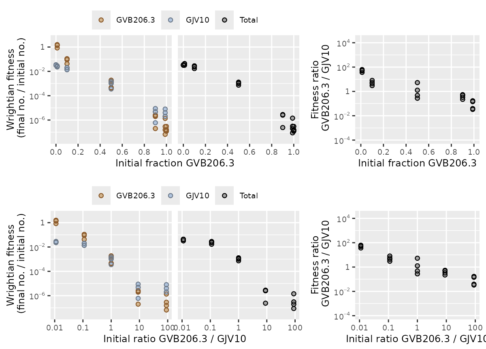
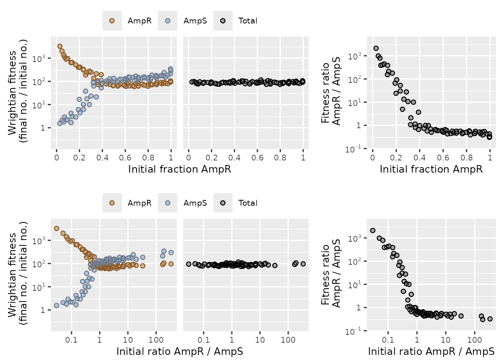
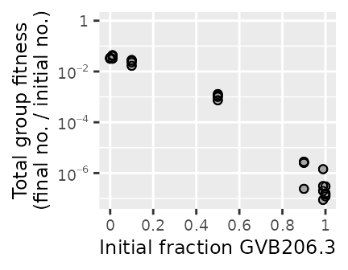
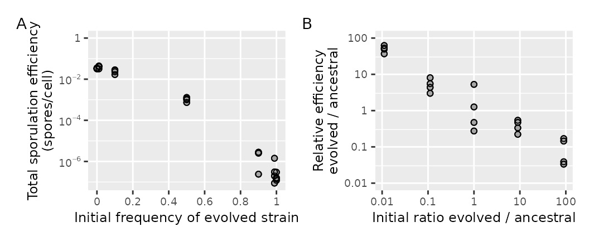
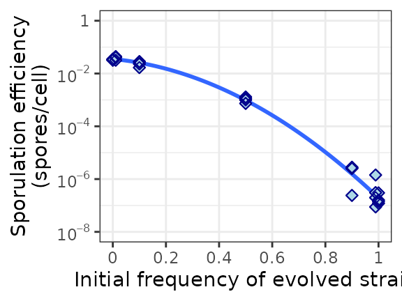
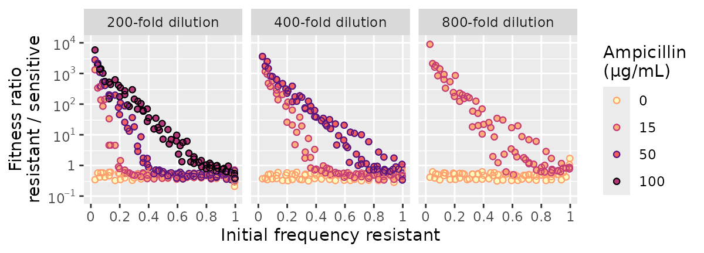

# Analyzing microbial interactions with microbimixr

A common way to study interactions among microbes is to do mix
experiments. You mix together different microbes (different strains of
bacteria, for example) and then see how their behavior depends on mix
frequency. How do they act differently together than on their own? How
does mixing affect their survival and reproduction—their fitness?

microbimixr is an R package that helps you analyze mix experiments. It
helps you get the most out of your data by making it easy to:

- Calculate best-practice fitness measures
- Identify which measures are best for your dataset and research
  question
- Make publication-quality figures showing interaction effects

The basic workflow is:

1.  Start from a data frame of observed microbial abundances
2.  Calculate fitness measures with
    [`calculate_mix_fitness()`](https://matryoshkev.github.io/microbimixr/reference/calculate_mix_fitness.md)
3.  Figure out which fitness and frequency measures to use with
    [`plot_mix_fitness()`](https://matryoshkev.github.io/microbimixr/reference/plot_mix_fitness.md)
4.  Plot the fitness data with microbimixr’s built-in functions or its
    add-ins for ggplot2
5.  Fit statistical models and plot them with your data

## Starting data

The starting point for microbimixr is a data frame that has the observed
abundance of each microbe at the beginning of the experiments and at the
end. The data could be any combination of strain abundance (like cell
counts or cell densities), strain frequency (the fraction of the total),
or total group abundance (all strains added together)—anything that’s
enough to define the absolute abundance of each strain. Each row of the
data frame should have all the data for a single observational unit: one
experimental replicate with one strain combination, one mix frequency,
one combination of experimental treatments, and so on.

Here’s an example with a dataset that’s included in the package. This is
from a small experiment mixing a wild-type strain of *Myxococcus*
bacteria with an experimentally-evolved cheater strain and letting them
make multicellular fruiting bodies together (smith *et al.* 2010). The
abundance quantities here are the number of cells from each strain
before and after development.

``` r

library(microbimixr)
head(data_smith_2010)
#>   exptl_block initial_cells_evolved initial_cells_ancestral
#> 1  2009-04-29               5.0e+08                 0.0e+00
#> 2  2009-04-29               4.5e+08                 5.0e+06
#> 3  2009-04-29               4.5e+08                 5.0e+07
#> 4  2009-04-29               2.5e+08                 2.5e+08
#> 5  2009-04-29               5.0e+07                 4.5e+08
#> 6  2009-04-29               5.0e+06                 4.5e+08
#>   final_spores_evolved final_spores_ancestral
#> 1                   60                      0
#> 2                   70                     20
#> 3                 1170                    240
#> 4               107000                 390000
#> 5              2100000                6300000
#> 6              4210000               10300000
```

Here’s another example. This is from an experiment that grew an
antibiotic-sensitive strain of *E. coli* together with an
antibiotic-resistant strain that detoxifies its local environment
(Yurtsev *et al.* 2013). The abundance quantities are total cell density
(in units of OD₆₀₀) and the fraction of cells that are the resistant
strain (from flow cytometry). The data include several experimental
treatments with different concentrations of antibiotic (`ampicillin`)
and different amounts of culture growth (`dilution`).

``` r

head(data_Yurtsev_2013)
#>   ampicillin dilution replicate culture_id OD_initial
#> 1          0      100         0          0 0.01438755
#> 2          0      100         0          1 0.01424020
#> 3          0      100         0          2 0.01662601
#> 4          0      100         0          3 0.01394884
#> 5          0      100         0          4 0.01574443
#> 6          0      100         0          5 0.01588097
#>   fraction_resistant_initial OD_final fraction_resistant_final
#> 1              -0.0003784523 1.664976            -0.0001694705
#> 2               0.0473674563 1.453604             0.0256142444
#> 3               0.0831943961 1.662601             0.0559489629
#> 4               0.1360970434 1.735172             0.0795238821
#> 5               0.1909207725 1.769998             0.1141049001
#> 6               0.2346178261 1.479329             0.1382856545
```

microbimixr works with most types of microbial abundance data.

## Calculate fitness

There are lots of quantities you can calculate to measure microbial
survival and reproduction. Many of them work well enough for a
particular system and particular research question. But only a few are
robust enough to be quantitatively meaningful across different species
and different types of interaction (smith & Inglis 2021). microbimixr
makes it easy to calculate the good ones.

The function to calculate fitness is
[`calculate_mix_fitness()`](https://matryoshkev.github.io/microbimixr/reference/calculate_mix_fitness.md).
It takes an input data frame of microbial abundances and a character
vector describing what the columns in the data are. Then it returns a
data frame with several measures of fitness and two measures of mix
frequency. Here’s an example:

``` r

fitness_myxo <- calculate_mix_fitness(
    data = data_smith_2010, 
    var_names = c(
        initial_number_A = "initial_cells_evolved",
        initial_number_B = "initial_cells_ancestral",
        final_number_A = "final_spores_evolved",
        final_number_B = "final_spores_ancestral", 
        name_A = "GVB206.3", 
        name_B = "GJV10"
    )
)
head(fitness_myxo)
#>     name_A name_B initial_fraction_A initial_ratio_A_B    fitness_A  fitness_B
#> 1 GVB206.3  GJV10         1.00000000               Inf 1.200000e-07         NA
#> 2 GVB206.3  GJV10         0.98901099       90.00000000 1.555556e-07 0.00000400
#> 3 GVB206.3  GJV10         0.90000000        9.00000000 2.600000e-06 0.00000480
#> 4 GVB206.3  GJV10         0.50000000        1.00000000 4.280000e-04 0.00156000
#> 5 GVB206.3  GJV10         0.10000000        0.11111111 4.200000e-02 0.01400000
#> 6 GVB206.3  GJV10         0.01098901        0.01111111 8.420000e-01 0.02288889
#>   fitness_total fitness_ratio_A_B
#> 1  1.200000e-07                NA
#> 2  1.978022e-07        0.03888889
#> 3  2.820000e-06        0.54166667
#> 4  9.940000e-04        0.27435897
#> 5  1.680000e-02        3.00000000
#> 6  3.189011e-02       36.78640777
```

The `var_names` argument tells the function what kinds of data you have
and which strain is which. In the output, `initial_fraction_A` and
`initial_ratio_A_B` are two measures of mix frequency. `fitness_A` and
`fitness_B` are the absolute fitness of each strain. `fitness_total` is
the fitness of the total group or subpopulation. And `fitness_ratio_A_B`
is the relative fitness of A to B within the same group.

Here’s an example with the *E. coli* data:

``` r

fitness_ecoli <- calculate_mix_fitness(
    data_Yurtsev_2013, 
    var_names = c(
        initial_number_total = "OD_initial",
        initial_fraction_A = "fraction_resistant_initial",
        final_number_total = "OD_final",
        final_fraction_A = "fraction_resistant_final",
        name_A = "AmpR",
        name_B = "AmpS"
    ), 
    keep = c("ampicillin", "dilution")
)
#> Warning in calculate_mix_fitness(): Some fraction_resistant_initial values not
#> in range [0, 1] -- Not biologically meaningful.
#> Warning in calculate_mix_fitness(): Some fraction_resistant_final values not in
#> range [0, 1] -- Not biologically meaningful.

head(fitness_ecoli)
#>   ampicillin dilution name_A name_B initial_fraction_A initial_ratio_A_B
#> 1          0      100   AmpR   AmpS      -0.0003784523     -0.0003783091
#> 2          0      100   AmpR   AmpS       0.0473674563      0.0497226938
#> 3          0      100   AmpR   AmpS       0.0831943961      0.0907437691
#> 4          0      100   AmpR   AmpS       0.1360970434      0.1575374205
#> 5          0      100   AmpR   AmpS       0.1909207725      0.2359729011
#> 6          0      100   AmpR   AmpS       0.2346178261      0.3065368309
#>   fitness_A fitness_B fitness_total fitness_ratio_A_B
#> 1  51.82082  115.6992     115.72341         0.4478925
#> 2  55.19903  104.4084     102.07749         0.5286838
#> 3  67.25088  102.9718     100.00000         0.6531001
#> 4  72.68639  132.5415     124.39537         0.5484049
#> 5  67.18882  123.0941     112.42060         0.5458331
#> 6  54.90398  104.8752      93.15104         0.5235174
```

Notice the warning messages here.
[`calculate_mix_fitness()`](https://matryoshkev.github.io/microbimixr/reference/calculate_mix_fitness.md)
will warn you if any of the data aren’t biologically meaningful. There
can’t be a negative number of cells, for example, and fractions are
bounded at zero and one. Some of the *E. coli* data include negative
fractions—probably a minor artifact of correcting for background
fluorescence in flow cytometry.

This example also shows how you can use the `keep` argument to include
columns in the fitness results for experimental treatments, experimental
block, and so on.

### Fitness math

The actual fitness calculations are very simple. If the initial
abundance of each strain (measured as the number or density of cells or
virions) is $`n_A`$ and $`n_B`$, and their final abundances are $`n'_A`$
and $`n'_B`$, then

``` math
\begin{aligned}
    \texttt{fitness_A} &= \; n'_A / n_A = w_A \\
    \texttt{fitness_B} &= \; n'_B / n_B = w_B \\
    \texttt{fitness_total} &= \; (n'_A + n'_B) / (n_A + n_B) \\
    \texttt{fitness_ratio_A_B} &= \; w_A / w_B
\end{aligned}
```

These quantities are unscaled Wrightian fitness measured over the entire
time period between the initial and final abundances. They measure fold
change in absolute abundance. So if a bacterial strain’s cell density
increases 100-fold, for example, its fitness will be $`w = 100`$. If it
decreases to 10% of its initial density, its fitness will be
$`w = 0.1`$. They’re usually best visualized and analyzed over
$`\log_{10}`$ scales.

These fitness measures are robust across different species and types of
interaction (smith & Inglis 2021). They let you quantitatively compare
fitness effects across systems. They’re good for statistical analyses of
effect sizes and confidence intervals. And they’re directly comparable
to fitness terms in theoretical models of microbial evolution.

The two measures of mix frequency are:

``` math
\begin{aligned}
    \texttt{initial_fraction_A} &= \; n_A / (n_A + n_B) \\
    \texttt{initial_ratio_A_B} &= \; n_A / n_B
\end{aligned}
```

`initial_fraction_A` runs from 0 to 1. `initial_ratio_A_B` runs from
negative infinity to positive infinity and is best analyzed over
$`\log_{10}`$ scales.

## Compare fitness measures

Some microbial interaction are easier to visualize, analyze, and
interpret with strain-focused fitness outcomes. Others are easier with
group-focused outcomes (smith & Inglis 2021). And effects can be more
relevant or more linear over one frequency scale than the other.

To see which measures are most useful for analyzing your dataset, use
[`plot_mix_fitness()`](https://matryoshkev.github.io/microbimixr/reference/plot_mix_fitness.md).
It draws a combined figure with strain fitness, total group fitness, and
relative within-group fitness plotted against two measures of mix
frequency.

``` r

plot_mix_fitness(fitness_myxo)
```



These plots help you see which fitness measures and mixing scales are
more informative or easier to analyze. For example, within-group
competition among these *Myxo* strains is negatively frequency-dependent
and is a linear function of log mixing ratio.

For complex datasets with many strain combinations or treatment
conditions, it may be easier to inspect subsets of the data.

``` r

fitness_ecoli |>
subset(ampicillin == 100 & dilution == 100) |>
plot_mix_fitness()
#> Warning in log(data[[var_names$initial_ratio_A_B]]): NaNs produced
```



This example also shows that microbimixr functions work with the R pipe
`|>`.

For the interaction between antibiotic-resistant and sensitive *E. coli*
strains shown above, total group fitness is just a constant determined
by experimental conditions—how much the culture was diluted when
passaged. So the within-group fitness ratio would by itself be a
succinct measure of the interesting effects.

## Plot fitness with microbimixr functions

Once you know which fitness measures to focus on, you can use
microbimixr to visualize them. The simplest way is to use its built-in
plot functions:

- [`plot_strain_fitness()`](https://matryoshkev.github.io/microbimixr/reference/plot_strain_fitness.md):
  Plot fitness of each strain separately
- [`plot_total_group_fitness()`](https://matryoshkev.github.io/microbimixr/reference/plot_total_group_fitness.md)
  : Plot fitness of total group or subpopulation
- [`plot_within_group_fitness()`](https://matryoshkev.github.io/microbimixr/reference/plot_within_group_fitness.md)
  : Plot within-group ratio of strain fitnesses

These functions let you reproduce the individual subplots from
[`plot_mix_fitness()`](https://matryoshkev.github.io/microbimixr/reference/plot_mix_fitness.md).
They’re a simple, straight-forward way to make figures designed for
fitness data.

``` r

plot_total_group_fitness(fitness_myxo)
```



They have some basic options:

``` r

library(patchwork)
fig_total <- plot_total_group_fitness(
    fitness_myxo,
    xlab = "Initial frequency of evolved strain",
    ylab = "Total sporulation efficiency\n(spores/cell)"
)
fig_within <- plot_within_group_fitness(
    fitness_myxo, 
    mix_scale = "ratio",
    xlab = "Initial ratio evolved / ancestral",
    ylab = "Relative efficiency\nevolved / ancestral",
    ylim = c(0.01, 100)
)
fig_total + fig_within + plot_annotation(tag_levels = "A")
```



This example also shows how to use the patchwork package to combine
subplots with `+`.

## Plot fitness with ggplot2

The fitness-plotting functions use graphics package ggplot2. You can
also use microbimixr’s various axes and other plot components when you
make ggplot2 figures on your own. These include:

- Mixing axes
  [`scale_x_initial_fraction()`](https://matryoshkev.github.io/microbimixr/reference/scale_x_initial_fraction.md)
  and
  [`scale_x_initial_ratio()`](https://matryoshkev.github.io/microbimixr/reference/scale_x_initial_ratio.md)
- Fitness axes
  [`scale_y_fitness()`](https://matryoshkev.github.io/microbimixr/reference/scale_y_fitness.md),
  [`scale_y_fitness_total()`](https://matryoshkev.github.io/microbimixr/reference/scale_y_fitness_total.md),
  and
  [`scale_y_fitness_ratio()`](https://matryoshkev.github.io/microbimixr/reference/scale_y_fitness_ratio.md)
- Data points
  [`geom_point_overlap()`](https://matryoshkev.github.io/microbimixr/reference/geom_point_overlap.md)
  that easier to read when they overlap

These functions return custom plot elements for ggplot2 that have
default settings appropriate for microbial mix experiments.

``` r

library(ggplot2)
fitness_myxo |>
    ggplot(aes(x = initial_fraction_A, y = fitness_total)) +
    scale_x_initial_fraction(name = "Initial frequency of evolved strain") +
    scale_y_fitness_total(name = "Sporulation efficiency\n(spores/cell)", limits = c(1e-8, 1)) +
    geom_smooth(method = "lm", se = FALSE, formula = y ~ poly(x, 2)) +
    geom_point_overlap(shape = 23, fill = "lightblue", color = "darkblue", size = 2) +
    theme_bw()
```



The plot elements are especially useful for more-complex figures with
different experimental conditions or multiple strain combinations.

``` r

name_amp <- "Ampicillin\n(\u03BCg/mL)"
fitness_ecoli |>
    subset(
        ampicillin %in% c(0, 15, 50, 100) & dilution %in% c(200, 400, 800) &
        fitness_ratio_A_B > 0 & is.finite(fitness_ratio_A_B)
    ) |>
    ggplot(mapping = aes(
        x = initial_fraction_A, y = fitness_ratio_A_B, 
        fill = factor(ampicillin), color = factor(ampicillin))
    ) +
    geom_point_overlap(na.rm = TRUE) +
    scale_x_initial_fraction(name = "Initial frequency resistant") +
    scale_y_fitness_ratio(
        name = "Fitness ratio\nresistant / sensitive", 
        limits = c(1e-1, 1e4)
    ) +
    scale_fill_viridis_d(name = name_amp, option = "magma", direction = -1, begin = 0.5, end = 1) +
    scale_color_viridis_d(name = name_amp, option = "magma", direction = -1, begin = 0, end = 0.8) +
    facet_wrap(~ dilution, labeller = as_labeller(function(x) paste0(x, "-fold dilution"))) 
```



## References

- smith j, Van Dyken JD, and Zee PC (2010) A generalization of
  Hamilton’s rule for the evolution of microbial cooperation. *Science*
  **328:** 1700-1703. <https://doi.org/10.1126/science.1189675>

- smith j and Inglis RF (2021) Evaluating kin and group selection as
  tools for quantitative analysis of microbial data. *Proceedings B*
  **288:** 20201657. <https://doi.org/10.1098/rspb.2020.1657>

- Yurtsev EA, Chao HX, Datta MS, Artemova T, and Gore J (2013) Bacterial
  cheating drives the population dynamics of cooperative antibiotic
  resistance plasmids. *Molecular Systems Biology* **9:** 683.
  <https://doi.org/10.1038/msb.2013.39>
